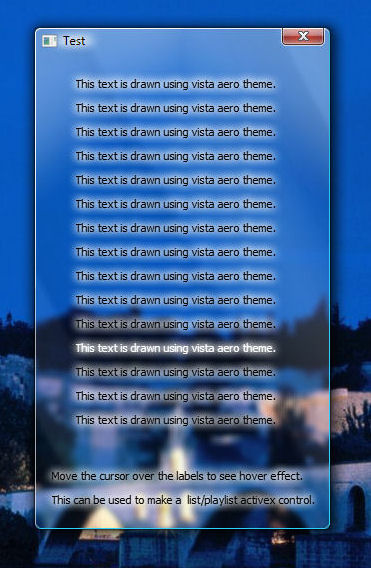



## Use of DWM and uxTheme API for WIndows Vista with aero support\.

### Description

This code shows how to use dwm API provided in windows vista to create a glass window and draw a theme text on it with hover effect.

Please Rate....
 
### More Info
 
You will need Windows Vista with Aero turned on.

             |
---                |---
**Submitted On**   |2007-09-21 00:38:42
**By**             |[Soumik Chatterjee](https://github.com/Planet-Source-Code/PSCIndex/blob/master/ByAuthor/soumik-chatterjee.md)
**Level**          |Advanced
**User Rating**    |4.7 (28 globes from 6 users)
**Compatibility**  |VB 6\.0
**Category**       |[Windows API Call/ Explanation](https://github.com/Planet-Source-Code/PSCIndex/blob/master/ByCategory/windows-api-call-explanation__1-39.md)
**World**          |[Visual Basic](https://github.com/Planet-Source-Code/PSCIndex/blob/master/ByWorld/visual-basic.md)
**Archive File**   |[Use\_of\_DWM20936612122007\.zip](https://github.com/Planet-Source-Code/soumik-chatterjee-use-of-dwm-and-uxtheme-api-for-windows-vista-with-aero-support__1-69756/archive/master.zip)

